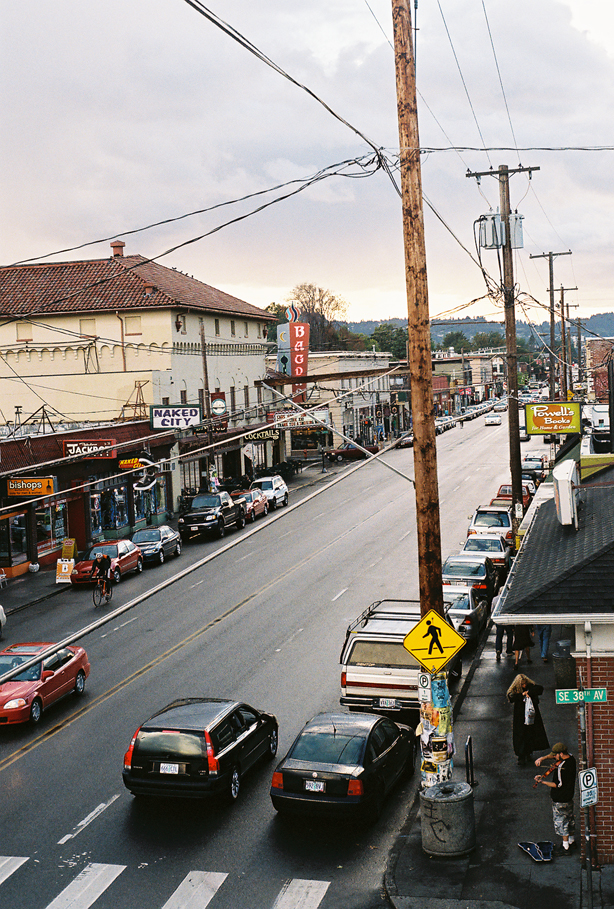

Still have this panic attack constant anxious feeling with work. Like, I’m always behind. More needs to already be completed. It’s not good enough. etc.\
\
**Away from work**\
Being away from work, I always feel this relief like, oh maybe everything is okay. Maybe I just needed a break. But the same cycle always repeats. I get back to work and the same things arise again and again.\
\
*I don’t feel connected with my teammates.*\
*I don’t trust and feel like I can be open with my teammates.*\
*I don’t trust my manager, and feel like I can’t go to him with anything. Especially after him telling me Carly requested the morning of for people to be assigned to projects, and felt that he had to comply to her request. e.g. Yes man, fall in line, do as you’re told culture.*\
\
And I have to mentor and guide myself. My newest thing I’ve discovered to try and help myself is being explicit to my team partners about my timeline for work, and giving myself more time to accomplish the different pieces of the process. e.g. I need 2 days to get data and inputs, I need 3 days to sketch, then after the initial brainstorm I can give you a better timeline….\
\
There’s no way to mince words on this. I’ve been in a pocket for awhile now of being angry, aggravated, flustered, and exasperated. Why? Work reasons: I don’t like the people I work with, I think our process is extremely disastrous, the projects don’t help our goals, I don’t have autonomy/freedom, and I no longer believe in our mission.\
\
Personal reasons: I’m in a weird place of living not somewhere I should be, no vibrancy of human intimacy, friendships are dwindling.\
\
**PORTLAND**\
\
Driving around Portland is a lot of fun. All the twisting bridges over the water and factories is beautiful. Can see a lot of good times here.\
\
The east side is great. Feels really cozy.

